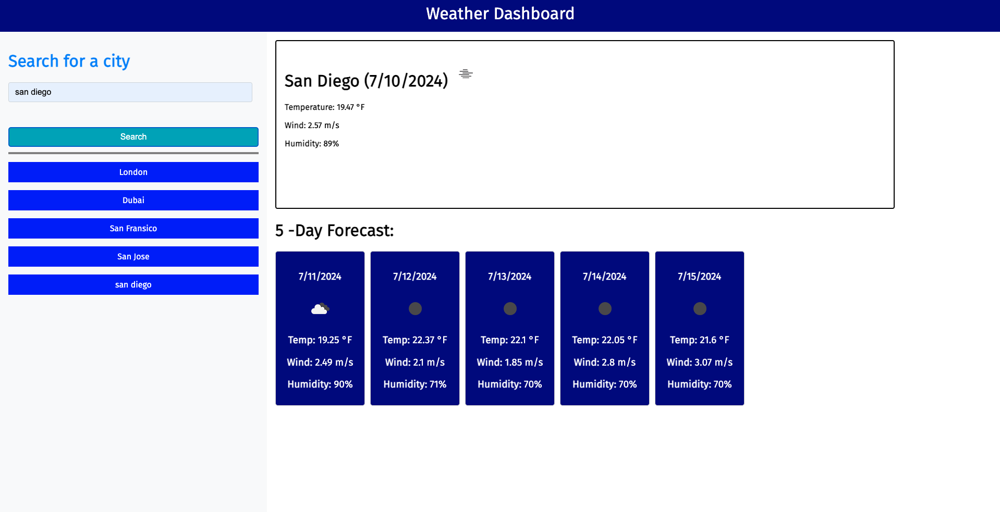

# Weather DashBoard Challenge 

# Description 

The Weather Forecast website allows users to search for weather information for any city . Users can get current weather conditions as weel as 5 day weather forecast . The website features dynamically updated content withou the need for page reloads .

# Features 

* Users can enter name of city to retrive weather data .
* The search content displays the current temperature , wind speed , humidity , weather icon with city name and date .
* The 5 day forecast provides details like temperature , wind speed ,humidty and weather icons for each day.
* The search history saves previously searched cities. 

# ScreenShot

# Deployment 

This application is deployed to GitHub Pages at:     https://preksha2408.github.io/Weather-dashboard-challenge06/

Repository Link for the challenge : https://github.com/Preksha2408/Weather-dashboard-challenge06.git

